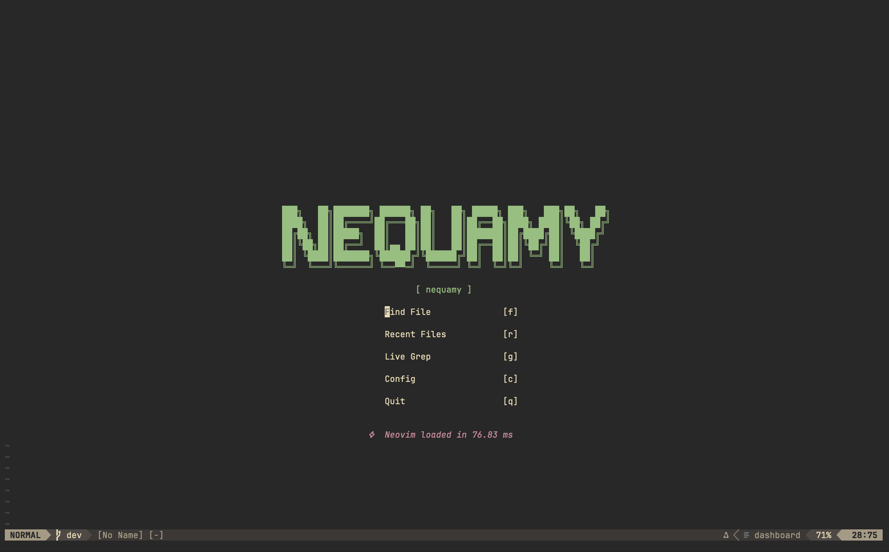
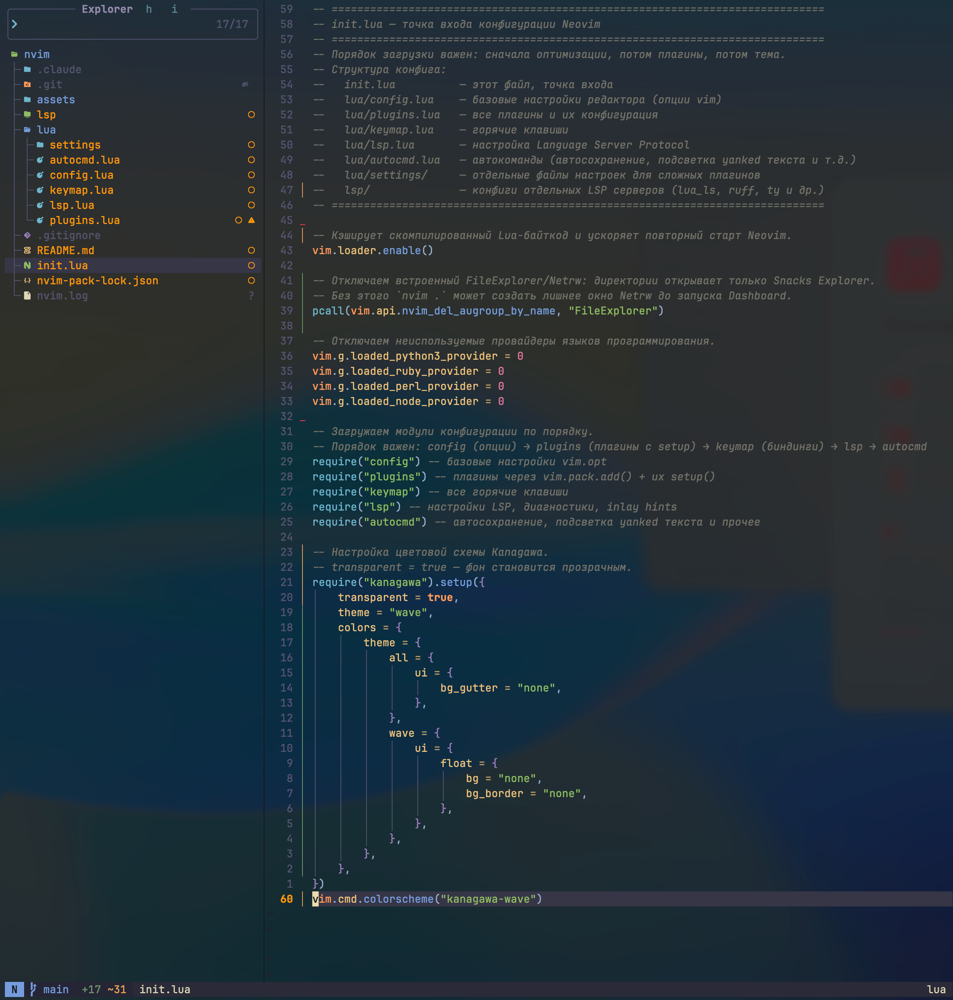

# Конфигурация NEOVIM v0.12 (nigtly)




## Описание

Данная конфигурация в основном направлена на написания кода на **RUST** с дополнительной поддержкой языка программирования **Python**.

## Состав
В конфигурации используется 21 плагин:

### Языковая поддержка и инструменты
- **mason** — управление LSP-серверами и внешними инструментами
- **nvim-lspconfig** — конфигурация LSP
- **nvim-cmp** — автодополнение
- **treesitter** — синтаксический анализ и подсветка
- **rustaceanvim** — полноценная поддержка Rust
- **crates.nvim** — работа с зависимостями Cargo
- **compiler-explorer.nvim** — интеграция с Compiler Explorer
- **venv-selector** — управление Python virtual environments

### Навигация и интерфейс
- **neo-tree** — файловый менеджер
- **fzf-lua** — поиск файлов, символов и команд
- **which-key** — подсказки сочетаний клавиш
- **lualine** — статусная строка
- **dashboard-nvim** — стартовый экран
- **nvim-web-devicons** — иконки

### Редактирование и UX
- **nvim-autopairs** — автоматические парные символы
- **nvim-surround** — работа с окружением
- **Comment.nvim** — комментирование кода
- **todo-comments** — TODO / FIXME / NOTE в коде

### Диагностика и Git
- **trouble.nvim** — диагностика и список проблем
- **gitsigns.nvim** — Git-индикаторы в буфере

## Требования

- Neovim v0.12 или новее (nightly)
- Git

# Установка

```
git clone git@github.com:nequamy/nqvim.git ~/.config/nvim/
```
